# MAID - Memory-Augmented Intelligence Database

A TypeScript/Bun-powered memory management system with vector embeddings and semantic search capabilities. Built with Drizzle ORM, SQLite, and SQLite-vec for efficient vector similarity search.

## Features

- 🧠 **Advanced Memory Management** - CRUD operations for user memories with automatic embedding generation
- 🔍 **Semantic Search** - Vector similarity search using SQLite-vec with 4096-dimensional embeddings
- ⚡ **High Performance** - Batch memory creation (~50 memories/second) with efficient K-NN search
- 🔗 **Cascade Deletes** - Automatic cleanup of memories and vectors when users are deleted
- 🌍 **Multilingual Support** - Works with multiple languages (Chinese, English, Spanish, etc.)
- 📊 **Memory Categories** - Organize memories by type: PERSONAL_INFO, PREFERENCE, GOAL, ROUTINE, RELATIONSHIP, HEALTH, EVENT, WORK, OTHER
- 🎯 **Importance Scoring** - Track memory importance (0-1), confidence (0-1), and metadata
- 💬 **Message Tracking** - Store and manage conversation history with extraction status
- 🤖 **Intelligent Memory Extraction** - Automatically extract facts from conversations and decide whether to add or update memories
- 🔄 **Version History** - Track content changes with previous_content field
- 🎚️ **Flexible LLM Support** - Works with both Ollama (local) and OpenAI (cloud) providers

## Prerequisites

- [Bun](https://bun.sh) v1.3.1 or higher
- [Ollama](https://ollama.ai) (if using Ollama for embeddings) or OpenAI API key
- SQLite 3.50.4+ with [sqlite-vec](https://github.com/asg017/sqlite-vec) support

## Installation

```bash
# Install dependencies
bun install
```

## Setup

### 1. Configure Environment

Create a `.env` file:

```bash
# Ollama Configuration (default)
OLLAMA_BASE_URL=http://localhost:11434
OLLAMA_EMBEDDING_MODEL=qwen3-embedding

# Or use OpenAI
OPENAI_API_KEY=your-api-key
OPENAI_EMBEDDING_MODEL=text-embedding-3-large

# Optional: Custom SQLite library path (macOS only)
# By default, automatically detects latest Homebrew SQLite version
# SQLITE_LIBRARY_PATH=/path/to/libsqlite3.dylib

# Optional: Custom database path
# SQLITE_DB_PATH=./custom-db.sqlite
```

### 2. Run Database Migrations

```bash
# Create database tables and vector embeddings table
bun migrate.ts
```

This will:

- Run Drizzle migrations to create `user` and `memory` tables
- Create `vec_memories` virtual table for vector embeddings
- Set up triggers for automatic vector cleanup
- Enable foreign key constraints for cascade deletes

## Development

### Run Development Server

```bash
bun run dev
```

Open http://localhost:3000

### Database Migrations

```bash
# Run migrations
bun migrate
```

### Type Checking

```bash
bun --bun tsc --noEmit
```

### Run Tests

```bash
# Run all tests
bun test

# Run specific test file
bun test tests/memory.test.ts
```

## Usage Examples

### Basic Memory Operations

```typescript
import { createMemory, listMemories, searchSimilarMemories } from "./src/memory";

// Create a memory
const memoryId = await createMemory({
  userId: 1,
  content: "User loves hiking in the mountains",
  category: "PREFERENCE",
  importance: 0.8,
  confidence: 0.9,
});

// List all memories for a user
const memories = await listMemories({
  userId: 1,
  limit: 10,
});

// Search for similar memories
const similar = await searchSimilarMemories("outdoor activities", {
  userId: 1,
  limit: 5,
  provider: "ollama",
});
```

### Memory Extraction from Conversations

```typescript
import { runMemoryExtraction } from "./src/extraction";
import { createMessages } from "./src/message";

// Store conversation messages
await createMessages([
  {
    userId: 1,
    role: "user",
    content: "I love trail running on weekends",
    extracted: false,
  },
  {
    userId: 1,
    role: "assistant",
    content: "That's great! I'll remember that.",
    extracted: false,
  },
]);

// Extract memories from unprocessed messages
const result = await runMemoryExtraction({
  userId: 1,
  embeddingProvider: "ollama",
  llmProvider: "ollama",
});

console.log(`Created ${result.createdMemoryIds.length} new memories`);
console.log(`Updated ${result.updatedMemoryIds.length} existing memories`);
```

### Run Complete Example

```bash
# Run the memory extraction example
bun examples/memory-extraction.ts

# Use OpenAI instead of Ollama
bun examples/memory-extraction.ts --provider openai
```

## Memory Extraction Flow

The memory extraction system intelligently processes conversation messages and maintains a unified memory database with automatic deduplication and updates.

### Flow Diagram

```mermaid
flowchart TD
    Start([Start: runMemoryExtraction]) --> FetchMsg[1. Fetch Pending Messages<br/>- Get unextracted messages<br/>- Filter by user/assistant role<br/>- Order by createdAt]

    FetchMsg --> CheckMsg{Messages<br/>found?}
    CheckMsg -->|No| ReturnEmpty[Return empty result]
    CheckMsg -->|Yes| ExtractFacts[2. Extract Facts from Conversation<br/>- Format conversation with IDs & timestamps<br/>- LLM structured output<br/>- Assign fact IDs: F1, F2, F3...<br/>- Extract: statement, category,<br/>importance, confidence]

    ExtractFacts --> BatchEmbed[3. Prepare Memory Matches<br/>🚀 OPTIMIZATION: Batch embed all facts at once<br/>- Generate embeddings for all facts<br/>- Search similar memories per fact<br/>- Assign unified labels: 1,2,3... memories<br/>then memoryCount+1, +2... for facts]

    BatchEmbed --> SplitFacts{Separate facts<br/>by similarity}

    SplitFacts -->|No similar<br/>memories| DirectADD[4a. Direct ADD Decisions<br/>🚀 OPTIMIZATION: Skip LLM call<br/>- Create ADD decision for each fact<br/>- Preserve fact metadata]

    SplitFacts -->|Has similar<br/>memories| LLMDecide[4b. LLM Decision Phase<br/>- Send memories + facts to LLM<br/>- LLM decides: ADD or UPDATE<br/>- Returns decisions with content]

    DirectADD --> MergeDecisions[Merge all decisions]
    LLMDecide --> MergeDecisions

    MergeDecisions --> Transaction[5. Apply Decisions in Transaction]

    Transaction --> Validate[5a. Validate & Prepare<br/>- ADD: Check fact exists, use fact metadata<br/>- UPDATE: Check memory exists,<br/>use highest importance fact metadata]

    Validate --> BatchCreate[5b. Batch Create Memories<br/>🚀 OPTIMIZATION: Reuse embeddings<br/>- Use pre-computed embeddings<br/>- Insert all memories at once<br/>- Insert all vectors at once]

    BatchCreate --> SeqUpdate[5c. Sequential Updates<br/>- Update each memory with new content<br/>- Regenerate embeddings<br/>- Track previous_content]

    SeqUpdate --> MarkMsg[5d. Mark Messages as Extracted<br/>- Update extraction status<br/>- Within same transaction]

    MarkMsg --> Commit{Transaction<br/>commit}
    Commit -->|Success| ReturnResult[Return Result<br/>- Created memory IDs<br/>- Updated memory IDs<br/>- Marked message IDs<br/>- Facts & decisions]
    Commit -->|Error| Rollback[Rollback all changes]

    ReturnResult --> End([End])
    ReturnEmpty --> End
    Rollback --> End

    style Start fill:#e1f5e1
    style End fill:#ffe1e1
    style BatchEmbed fill:#fff4e1
    style DirectADD fill:#fff4e1
    style BatchCreate fill:#fff4e1
    style Transaction fill:#e1e5ff
```



### Key Components

#### 1. Fact Extraction (`extractFactsFromConversation`)
- **Input**: Conversation messages
- **Process**:
  - Format messages with IDs and timestamps
  - LLM extracts structured facts using `FactRetrievalSchema`
  - Each fact includes: `statement`, `category`, `importance`, `confidence`
- **Output**: Array of facts with metadata
- **Note**: Metadata is evaluated **only once** here, never re-evaluated

#### 2. Memory Matching (`prepareMemoryMatches`)
- **Optimization**: Batch embeds all facts in one API call
- **Process**:
  - Generate embeddings for all facts simultaneously
  - Search for similar existing memories for each fact
  - Assign unified numeric labels (1, 2, 3... for memories, then continue for facts)
  - Build relationship map between facts and similar memories
- **Output**: `factMatches`, `memoryMatches`, `factVectors`

#### 3. Decision Making (`decideMemoryActions`)
- **Optimization**: Separate facts into two groups
  - **Facts WITHOUT similar memories** → Direct ADD (no LLM call needed)
  - **Facts WITH similar memories** → LLM decides ADD or UPDATE
- **Process**:
  - Direct ADD preserves fact's metadata (category, importance, confidence)
  - LLM receives memory snapshot and fact summaries
  - LLM returns decisions with action (ADD/UPDATE) and merged content
- **Output**: Combined array of ADD/UPDATE decisions

#### 4. Application (`applyMemoryDecisions`)
- **Transaction**: All operations are atomic (rollback on failure)
- **Three-pass approach**:
  1. **Validate & Prepare**: Check references, prepare metadata
     - ADD: Use fact's original metadata
     - UPDATE: Use highest importance triggering fact's metadata
  2. **Batch Create**: Insert all ADD decisions with pre-computed embeddings
  3. **Sequential Update**: Apply each UPDATE with embedding regeneration
  4. **Mark Messages**: Update extraction status in same transaction
- **Output**: Created/updated memory IDs, marked message IDs

### Optimizations

1. **🚀 Batch Embedding**: All facts are embedded in one API call instead of N calls
2. **🚀 Direct ADD**: Facts without similar memories skip LLM decision phase entirely
3. **🚀 Pre-computed Embeddings**: Reuse embeddings from search phase when creating memories
4. **🚀 Unified Labeling**: Simple numeric IDs (1, 2, 3...) eliminate ID mapping complexity
5. **🔒 Transaction**: Ensures atomicity - either all operations succeed or none do

### Metadata Handling

**Important**: Metadata (category, importance, confidence) is evaluated **once** during fact extraction:

- **Extraction Phase**: LLM evaluates each fact and assigns metadata
- **Decision Phase**: LLM only decides ADD/UPDATE actions, does not re-evaluate metadata
- **ADD Operation**: Uses fact's original metadata
- **UPDATE Operation**: Uses the triggering fact's metadata (highest importance if multiple facts)

This design ensures:
- Consistent metadata evaluation
- Reduced LLM cognitive load during decision-making
- Clear separation of concerns (extraction vs. decision)

## API Documentation

### Memory Module (`src/memory.ts`)

**Core Functions:**
- `createMemory(input, provider?)` - Create a single memory with embedding
- `createMemories(inputs, provider?)` - Batch create multiple memories
- `getMemory(memoryId)` - Retrieve a memory by ID
- `updateMemory(memoryId, updates, provider?)` - Update memory and regenerate embedding
- `softDeleteMemory(memoryId)` - Mark memory as deleted
- `hardDeleteMemory(memoryId)` - Permanently remove memory
- `restoreMemory(memoryId)` - Restore a soft-deleted memory
- `listMemories(options)` - List memories with filtering and pagination
- `searchSimilarMemories(query, options)` - Vector similarity search

**Statistics & Utilities:**
- `countUserMemories(userId, includeDeleted?)` - Count memories for a user
- `getMemoryStats(userId)` - Get aggregated statistics
- `getActiveMemories(userId, limit?)` - Get all non-deleted memories
- `getDeletedMemories(userId, limit?)` - Get soft-deleted memories
- `getMemoryHistory(userId, options?)` - Get all memory versions

### Message Module (`src/message.ts`)

**Functions:**
- `createMessage(input, db?)` - Create a single message
- `createMessages(inputs, db?)` - Batch create messages
- `listMessages(options)` - List messages with filtering
- `markMessagesExtracted(messageIds, extracted)` - Mark messages as processed

### Extraction Module (`src/extraction.ts`)

**Main Function:**
- `runMemoryExtraction(options)` - Extract facts from conversations and update memories

**Options:**
- `userId` - The user ID to process
- `messageLimit?` - Max messages to process
- `similarityLimit?` - Max similar memories to consider per fact (default: 3)
- `embeddingProvider?` - Provider for embeddings ("ollama" | "openai")
- `llmProvider?` - Provider for LLM calls ("ollama" | "openai")
- `llmModel?` - Specific model to use
- `minConfidence?` - Minimum confidence threshold for facts
- `memoryProvider?` - Provider for memory operations

**Returns:**
- `messages` - Processed messages
- `facts` - Extracted facts from conversation
- `decisions` - Memory ADD/UPDATE decisions
- `createdMemoryIds` - IDs of newly created memories
- `updatedMemoryIds` - IDs of updated memories
- `markedMessageIds` - Messages marked as extracted

## Troubleshooting

**"No such table: vec_memories"**

- Run `bun migrate.ts` to create the vector table

**"Connection refused" for Ollama**

- Ensure Ollama is running: `ollama serve`
- Check `OLLAMA_BASE_URL` in `.env`
- Verify embedding model is available: `ollama pull qwen3-embedding`

**Low similarity scores**

- Lower `minSimilarity` threshold (try 0.3-0.5)
- Use content-based embeddings (enabled by default)
- Ensure query and content use similar language

**Cascade deletes not working**

- Foreign keys are enabled by default in `src/db/index.ts`
- Run tests to verify: `bun test-cascade-delete.ts`

## License

MIT

## Contributing

Contributions are welcome! Please ensure:

- Tests pass for cascade deletes and data preservation
- Code follows existing patterns and TypeScript types
- Examples are updated if adding new features

---

Built with ❤️ using [Bun](https://bun.sh), [Drizzle ORM](https://orm.drizzle.team), and [SQLite-vec](https://github.com/asg017/sqlite-vec)
